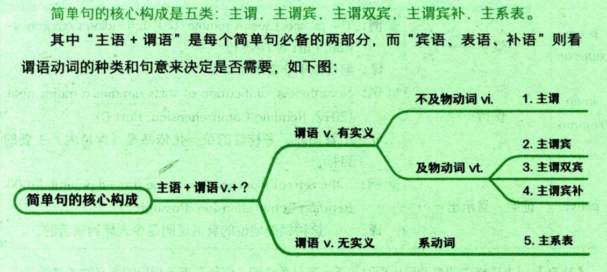

# Part 1. 简单句
## 一、核心
### 1. 核心构成 

主谓双宾：
- 通常双宾语是 "人 + 物"，人是间接宾语，物是直接宾语。
- 在 "物 + 人" 的情况下，中间要加入介词，通常是 to 强调动作的方向，而 for 强调动作的目的。

主谓宾补：
- 宾补是用来补充说明宾语的，因此它与宾语有逻辑上的主谓关系，简单来说就是在宾语和宾补的内容中间加上中文 “是”，构成完整的句意。

常见系动词（以下表格中四类动词出现时，不一定是系动词。必须在表示相应的含义时才是系动词。）：

|                       系动词                         |                          含义                                 |
|                       :--:                           |                         :--:                                 |
|                        be                            |  是 （单独出现，无其他实义动词）                            |
| get、become、turn、go、grow                           | 变得，成为                                                    |
| look、sound、smell、taste、feel                       | 看/听/闻/尝/感觉起来...... （感官动词）                     |
| seem、appear    keep、remain    prove | 似乎......    保持......    证明，显示出...... |
|                                                       |                                                              |

### 2. 谓语动词的变化
> 主要包含五种变化：时态、情态、语态、否定、强调

#### 2.1. 时态
`时态 = 时间 + 状态`，只有时态是每一个谓语动词必有的，其中时间分为*过去、现在、将来、过去将来*，状态分为*一般、进行、完成、完成进行*。
>> “过去将来”的出发点不是现在，而是站在过去，看过去之后将要发生的事情。
>
>> “完成进行”表示xx时间的之前，强调一件事进行的过程。

1. 一般时态
    > 不强调**进行**和**完成**，只表达事情发生在这个时间段内。

    fdfd  
2. 进行时态

3. 完成时态

4. 完成进行时态

## 二、拓展

## 三、非谓语动词

# Part 2. 长难句